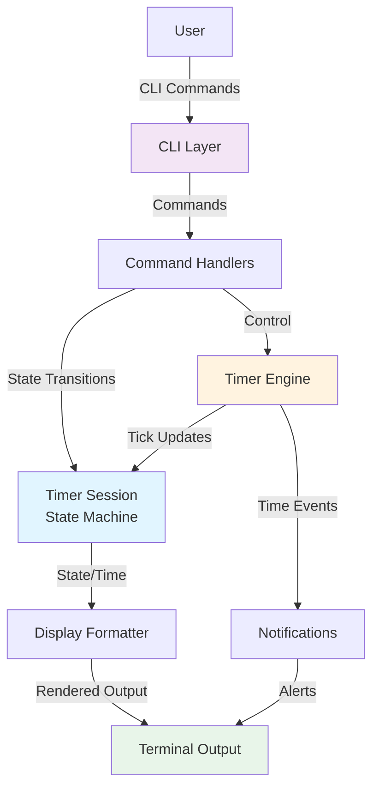
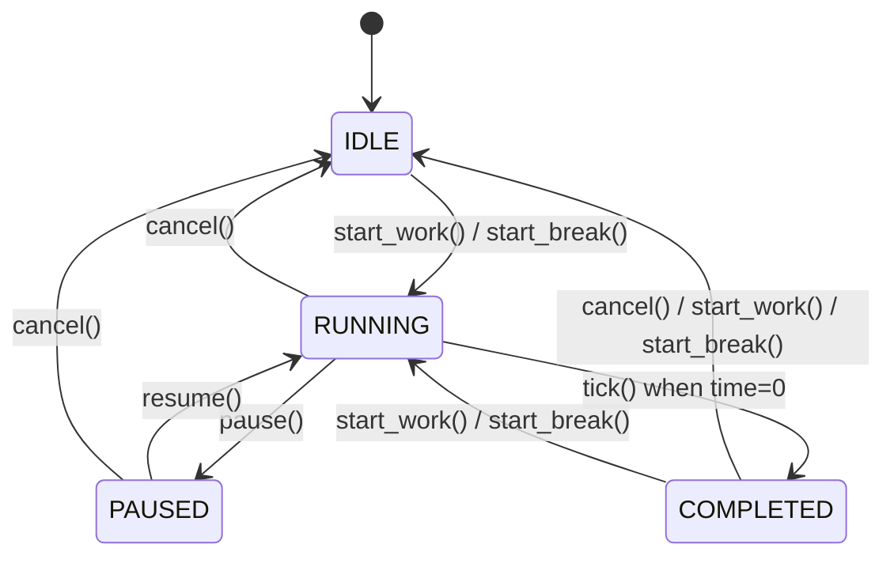
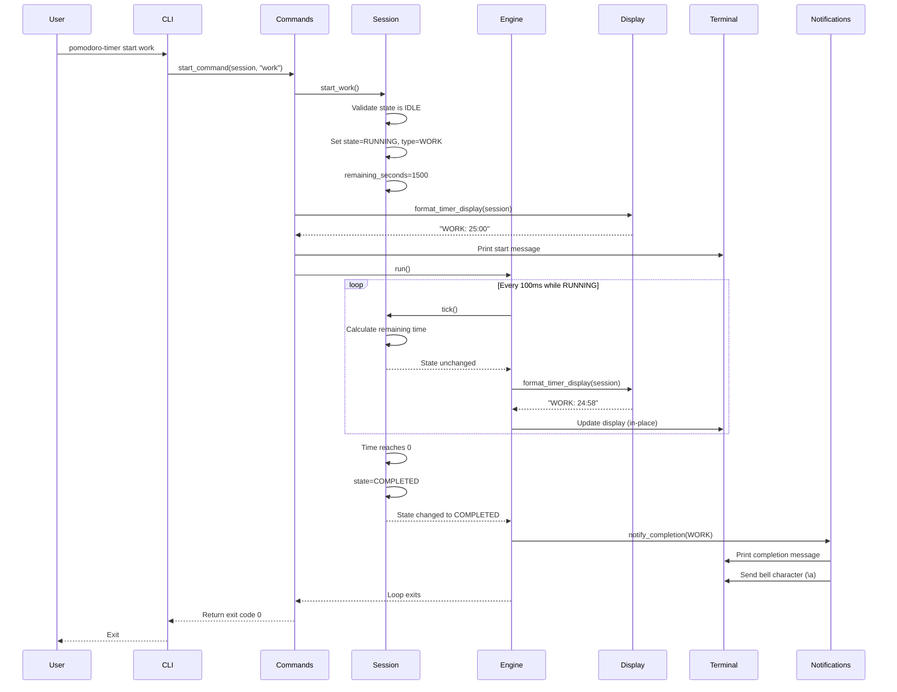
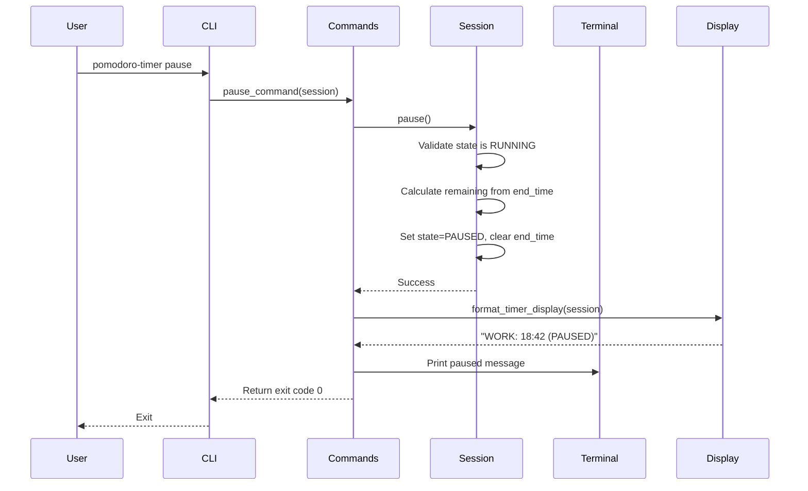
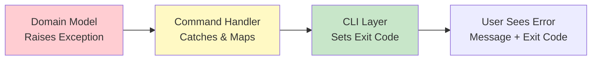

# Architecture: Pomodoro Timer Sessions

**Created**: October 17, 2025  
**Feature**: Pomodoro Timer Sessions (001)  
**Purpose**: Define system architecture, component interactions, and design patterns

## Overview

The Pomodoro Timer is a CLI application built with Python 3.12+ using only the standard library. It implements a simple yet robust architecture centered around a state machine for session management, an asynchronous timer engine for countdown logic, and a command-line interface for user interaction.

**Core Principles**:
- **Simplicity**: Stdlib only, no external runtime dependencies
- **Single Responsibility**: Clear separation between state, timer logic, display, and commands
- **Type Safety**: Full type hints for all components
- **Testability**: Pure functions where possible, dependency injection for side effects

---

## System Architecture

### High-Level Architecture



### Component Layers

```
┌─────────────────────────────────────────────────────────┐
│                    CLI Layer (Entry Point)              │
│  • Argument parsing                                     │
│  • Command routing                                      │
│  • Error handling & exit codes                          │
└─────────────────┬───────────────────────────────────────┘
                  │
┌─────────────────▼───────────────────────────────────────┐
│               Command Handlers Layer                     │
│  • start_command(type)                                  │
│  • pause_command()                                      │
│  • resume_command()                                     │
│  • cancel_command()                                     │
│  • status_command()                                     │
└─────────────────┬───────────────────────────────────────┘
                  │
        ┌─────────┴─────────┐
        │                   │
┌───────▼──────┐    ┌──────▼──────────┐
│ Timer Engine │    │ Display Formatter│
│ (asyncio)    │    │ (Pure Functions) │
│              │    │                  │
│ • Main loop  │    │ • Format time    │
│ • Tick logic │    │ • Format state   │
│ • Completion │    │ • ANSI codes     │
└───────┬──────┘    └─────────────────┘
        │
┌───────▼────────────────────────────────────────┐
│           Domain Model Layer                   │
│                                                 │
│  ┌──────────────┐      ┌──────────────┐       │
│  │ TimerSession │      │   Enums      │       │
│  │              │      │              │       │
│  │ • State      │◀─────│• SessionType │       │
│  │ • Type       │      │• SessionState│       │
│  │ • Remaining  │      └──────────────┘       │
│  │ • Methods    │                              │
│  └──────────────┘                              │
│                                                 │
│  ┌──────────────────────────────────┐         │
│  │      Custom Exceptions           │         │
│  │ • InvalidStateTransition         │         │
│  │ • SessionAlreadyActive          │         │
│  └──────────────────────────────────┘         │
└────────────────────────────────────────────────┘
```

---

## Component Details

### 1. CLI Layer (`cli/`)

**Responsibility**: Parse commands, route to handlers, manage I/O and exit codes

**Files**:
- `cli/commands.py` - Command handler functions
- `cli/display.py` - Terminal output formatting

**Key Functions**:

```python
# commands.py
async def start_command(session: TimerSession, session_type: str) -> int:
    """Execute start command with given session type.
    
    Args:
        session: The timer session instance
        session_type: "work" or "break"
        
    Returns:
        Exit code (0=success, 1=error, 2=invalid state, 3=interrupted)
    """

def pause_command(session: TimerSession) -> int:
    """Execute pause command."""

def resume_command(session: TimerSession) -> int:
    """Execute resume command."""

def cancel_command(session: TimerSession) -> int:
    """Execute cancel command."""

def status_command(session: TimerSession) -> int:
    """Execute status command."""
```

**Design Patterns**:
- **Command Pattern**: Each CLI command maps to a handler function
- **Dependency Injection**: Session instance passed to commands (enables testing)
- **Exit Code Strategy**: Consistent error code mapping across commands

**Interactions**:
- Receives user input via `argparse`
- Calls domain model methods on `TimerSession`
- Invokes `Engine.run()` for timer loop
- Uses `display.py` for output formatting

---

### 2. Domain Model Layer (`models/`)

**Responsibility**: Core business logic, state management, and data structures

**Files**:
- `models/types.py` - Enums (SessionType, SessionState)
- `models/session.py` - TimerSession class
- `models/exceptions.py` - Custom exceptions

#### SessionType Enum

```python
class SessionType(enum.Enum):
    """Types of Pomodoro timer sessions."""
    
    WORK = "work"
    BREAK = "break"
    
    @property
    def duration_seconds(self) -> int:
        """Duration in seconds (1500 for work, 300 for break)."""
        return 1500 if self == SessionType.WORK else 300
    
    @property
    def display_name(self) -> str:
        """Human-readable name ("Work" or "Break")."""
        return self.value.capitalize()
```

#### SessionState Enum

```python
class SessionState(enum.Enum):
    """States of a timer session lifecycle."""
    
    IDLE = "idle"
    RUNNING = "running"
    PAUSED = "paused"
    COMPLETED = "completed"
```

#### TimerSession Class

```python
@dataclass
class TimerSession:
    """Represents a Pomodoro timer session with state management."""
    
    session_type: SessionType = SessionType.WORK
    state: SessionState = SessionState.IDLE
    remaining_seconds: int = 0
    start_time: float | None = None
    end_time: float | None = None
    
    # State transition methods
    def start_work(self) -> None: ...
    def start_break(self) -> None: ...
    def pause(self) -> None: ...
    def resume(self) -> None: ...
    def cancel(self) -> None: ...
    def tick(self) -> bool:
        """Update time and return True if state changed to COMPLETED."""
    
    # Derived properties
    @property
    def is_active(self) -> bool: ...
    
    @property
    def progress_percentage(self) -> float: ...
    
    @property
    def formatted_time(self) -> str: ...
```

**State Machine**:



**Design Patterns**:
- **State Pattern**: Explicit state machine with guarded transitions
- **Value Object**: Enums are immutable with derived properties
- **Data Class**: TimerSession uses Python dataclass for clarity

**Validation**:
- State transitions enforce business rules (e.g., can't start when active)
- Raises custom exceptions for invalid operations
- Type hints ensure correct usage

---

### 3. Timer Engine Layer (`timer/`)

**Responsibility**: Asynchronous countdown loop, time tracking, completion detection

**Files**:
- `timer/engine.py` - Core timer loop
- `timer/notifications.py` - Notification handlers

#### Engine Architecture

```python
class TimerEngine:
    """Manages the asynchronous timer countdown loop."""
    
    def __init__(
        self,
        session: TimerSession,
        display_callback: Callable[[TimerSession], None],
        notification_callback: Callable[[SessionType], None],
    ):
        """Initialize engine with callbacks for display and notifications."""
        self._session = session
        self._display = display_callback
        self._notify = notification_callback
    
    async def run(self) -> None:
        """Run the timer loop until completion or interruption.
        
        - Calls session.tick() every 100ms (10 Hz)
        - Invokes display_callback on time changes
        - Detects completion and triggers notification
        - Handles KeyboardInterrupt (Ctrl+C)
        """
```

**Loop Logic**:

```mermaid
flowchart TD
    Start[Start Loop] --> Check{Session<br/>RUNNING?}
    Check -->|No| Exit[Exit Loop]
    Check -->|Yes| Tick[Call session.tick()]
    Tick --> Changed{State changed<br/>to COMPLETED?}
    Changed -->|Yes| Notify[Trigger notification]
    Notify --> Display[Update display]
    Changed -->|No| Display
    Display --> Sleep[await asyncio.sleep(0.1)]
    Sleep --> Check
    
    style Notify fill:#ffeb3b
    style Tick fill:#e1f5ff
```

**Design Patterns**:
- **Observer Pattern**: Callbacks notify display and notification handlers
- **Separation of Concerns**: Engine only manages loop, delegates rendering
- **Async/Await**: Non-blocking timer loop using asyncio

**Time Accuracy**:
- Uses `time.time()` (monotonic system time) for accuracy
- 100ms tick interval (10 Hz) provides smooth display updates
- Actual time remaining calculated from wall clock, not tick count
- Guarantees accuracy within 1 second per FR requirements

---

### 4. Display Layer (`cli/display.py`)

**Responsibility**: Format session state and time for terminal output

**Functions**:

```python
def format_timer_display(session: TimerSession) -> str:
    """Format timer for in-place terminal update.
    
    Returns:
        String like "WORK: 25:00" or "BREAK: 03:15 (PAUSED)"
    """

def format_status_output(session: TimerSession) -> str:
    """Format status command output.
    
    Returns:
        Multi-line string with state, type, time, progress
    """

def format_completion_message(session_type: SessionType) -> str:
    """Format completion notification message.
    
    Returns:
        Message like "🔔 Work session complete! Time for a break."
    """

def clear_line() -> str:
    """Return ANSI escape sequence to clear current line."""
    return "\r\033[K"

def move_cursor_up(n: int = 1) -> str:
    """Return ANSI escape sequence to move cursor up n lines."""
    return f"\033[{n}A"
```

**Design Patterns**:
- **Pure Functions**: All display functions are stateless
- **Single Responsibility**: Each function handles one formatting concern
- **ANSI Codes**: Uses standard terminal control sequences

**Output Examples**:

```
# Timer display (in-place update)
WORK: 24:58

# Timer display (paused)
WORK: 18:42 (PAUSED)

# Completion message
🔔 Work session complete! Time for a break.

# Status output
Status: Running
Type: Work
Time Remaining: 18:42
Progress: 25.3%
```

---

### 5. Notifications Layer (`timer/notifications.py`)

**Responsibility**: Alert users when sessions complete

**Functions**:

```python
def send_visual_notification(message: str) -> None:
    """Display visual notification in terminal.
    
    Args:
        message: Completion message to display
    """
    print(f"\n{message}", flush=True)

def send_audio_notification() -> None:
    """Trigger terminal bell for audio alert."""
    print("\a", end="", flush=True)  # ASCII BEL character

def notify_completion(session_type: SessionType) -> None:
    """Send both visual and audio notifications for completion.
    
    Args:
        session_type: Type of session that completed
    """
    message = format_completion_message(session_type)
    send_visual_notification(message)
    send_audio_notification()
```

**Design Patterns**:
- **Strategy Pattern**: Multiple notification mechanisms (visual, audio)
- **Facade Pattern**: Single `notify_completion()` coordinates both types
- **Best Effort**: Audio notification may not work on all terminals (acceptable)

---

## Data Flow

### Starting a Work Session



### Pausing a Session



---

## Design Patterns Summary

| Pattern | Where Used | Why |
|---------|------------|-----|
| **State Machine** | TimerSession | Explicit state transitions with validation |
| **Command Pattern** | CLI commands | Map user actions to handler functions |
| **Observer Pattern** | Timer engine callbacks | Decouple timer loop from display/notifications |
| **Dependency Injection** | Command handlers | Pass session instance for testability |
| **Strategy Pattern** | Notifications | Multiple alert mechanisms (visual, audio) |
| **Facade Pattern** | notify_completion() | Simplify multi-step notification process |
| **Pure Functions** | Display formatters | Stateless, testable rendering logic |
| **Value Object** | Enums | Immutable types with derived properties |

---

## Technology Choices

### Python Standard Library Only

**Decision**: No external runtime dependencies

**Rationale**:
- **Simplicity**: Reduces deployment complexity, no dependency management
- **Portability**: Works anywhere Python 3.12+ is installed
- **Security**: Fewer supply chain risks, smaller attack surface
- **Performance**: Stdlib is optimized and battle-tested

**Stdlib Modules Used**:
- `asyncio` - Async timer loop
- `time` - High-precision time tracking
- `enum` - Type-safe enums
- `dataclasses` - Clean data structures
- `argparse` - CLI argument parsing
- `sys` - Exit codes, stdout/stderr

### Asyncio Event Loop

**Decision**: Use `asyncio` for timer loop instead of threading

**Rationale**:
- **Single-threaded**: Simpler reasoning, no race conditions
- **Cooperative**: Explicit control flow with async/await
- **Standard**: Built into Python 3.12+
- **Testable**: Easy to mock `asyncio.sleep()` in tests

**Trade-offs**:
- Can't block the loop (acceptable: no blocking operations)
- All operations must be async (fine: timer is the only async operation)

### State Machine Pattern

**Decision**: Explicit state machine with enum-based states

**Rationale**:
- **Clarity**: All valid states and transitions documented
- **Safety**: Invalid transitions raise exceptions immediately
- **Testability**: Easy to verify state transition logic
- **Maintainability**: Adding states/transitions is straightforward

**Alternative Considered**: Implicit state based on boolean flags
- Rejected: Error-prone, hard to validate, unclear transitions

---

## Error Handling Strategy

### Exception Hierarchy

```python
class TimerError(Exception):
    """Base exception for all timer-related errors."""

class InvalidStateTransition(TimerError):
    """Attempted invalid state transition (e.g., pause when idle)."""

class SessionAlreadyActive(TimerError):
    """Attempted to start session while one is active."""
```

### Error Propagation



### Exit Code Mapping

| Exception Type | Exit Code | stderr Message |
|----------------|-----------|----------------|
| `InvalidStateTransition` | 2 | Error: [specific state error] |
| `SessionAlreadyActive` | 2 | Error: A session is already running... |
| `ValueError` (bad args) | 1 | Error: Invalid session type... |
| `KeyboardInterrupt` | 3 | (no message, silent exit) |
| Any other | 1 | Unexpected error: [error message] |

---

## Testing Architecture

### Test Structure

```
tests/
├── unit/                    # Fast, isolated tests
│   ├── test_types.py        # Enum tests
│   ├── test_session.py      # State machine tests
│   ├── test_engine.py       # Timer loop tests (mocked time)
│   ├── test_notifications.py# Notification tests (mocked I/O)
│   └── test_display.py      # Formatting tests (pure functions)
└── integration/             # End-to-end tests
    └── test_timer_workflows.py  # User story scenarios
```

### Testing Patterns

**Unit Tests**:
- **State Machine**: Test all valid and invalid transitions
- **Time Calculations**: Mock `time.time()` with `freezegun`
- **Display Formatting**: Test pure functions with various inputs
- **Async Logic**: Use `pytest-asyncio` for async test fixtures

**Integration Tests**:
- **User Stories**: One test per acceptance scenario
- **Real Interactions**: Minimize mocking, test actual component interactions
- **Time Acceleration**: Mock `asyncio.sleep()` to speed up tests

**Example Test Structure**:

```python
# Unit test (fast, isolated)
@pytest.mark.asyncio
async def test_session_completes_after_duration(freezer):
    """Test session transitions to COMPLETED when time expires."""
    session = TimerSession()
    session.start_work()
    
    freezer.tick(1500)  # Advance time 25 minutes
    session.tick()
    
    assert session.state == SessionState.COMPLETED
    assert session.remaining_seconds == 0

# Integration test (end-to-end)
@pytest.mark.asyncio
async def test_full_work_session_workflow(capsys):
    """Test User Story 1: Start and complete work session."""
    session = TimerSession()
    exit_code = await start_command(session, "work")
    
    # Wait for completion (accelerated in test)
    await asyncio.sleep(0.1)
    
    assert exit_code == 0
    captured = capsys.readouterr()
    assert "Work session complete" in captured.out
    assert session.state == SessionState.COMPLETED
```

---

## Performance Considerations

### Timer Accuracy

**Target**: Within 1 second accuracy over 25 minutes (SC-001, SC-002)

**Implementation**:
- Calculate remaining from wall clock (`time.time()`), not tick count
- Tick every 100ms (10 Hz) for smooth display
- Update display only when seconds change (avoid flicker)

**Drift Tolerance**:
- System time changes (DST, manual adjustment) may cause drift
- Acceptable drift: ±5 seconds over 25 minutes
- No compensation mechanism (keeps implementation simple)

### Display Refresh Rate

**Target**: At least 1 Hz (once per second) per SC-004

**Implementation**: 10 Hz tick rate provides smooth updates

**Optimization**: Only write to terminal when seconds value changes

### Memory Usage

**Target**: Minimal (single session, no history)

**Implementation**:
- Single `TimerSession` instance (no history tracking)
- No persistence (no file I/O, no database)
- Garbage collected on app exit

### CPU Usage

**Target**: Negligible when idle, <1% when running

**Implementation**:
- `asyncio.sleep()` yields CPU during wait
- 100ms sleep between ticks (cooperative multitasking)
- No busy-wait loops

---

## Deployment Architecture

### Single-File Entry Point

```python
# src/pomodoro_timer/__init__.py
def main() -> int:
    """Main entry point for CLI application."""
    try:
        parser = create_argument_parser()
        args = parser.parse_args()
        session = TimerSession()
        return route_command(args, session)
    except KeyboardInterrupt:
        return 3
    except Exception as e:
        print(f"Unexpected error: {e}", file=sys.stderr)
        return 1

if __name__ == "__main__":
    sys.exit(main())
```

### Package Structure

```
pomodoro_timer/          # Namespace package
├── __init__.py          # Entry point with main()
├── cli/                 # CLI layer
├── models/              # Domain model
└── timer/               # Timer engine
```

### Installation

```bash
# Install from source
uv sync

# Run via CLI entry point (configured in pyproject.toml)
uv run pomodoro-timer start work

# Or run module directly
uv run python -m pomodoro_timer start work
```

---

## Future Architecture Considerations

### Not in Scope (Current Implementation)

The following are intentionally excluded to maintain simplicity:

1. **Persistence**: No session history, statistics, or state restoration
2. **Configuration**: No user preferences or customizable durations
3. **Multiple Timers**: Single active session only
4. **Long Breaks**: Only 25-minute work and 5-minute breaks
5. **Task Management**: No to-do lists or task tracking
6. **GUI**: CLI only, no graphical interface

### Potential Extensions (Future Considerations)

If requirements change, the architecture supports these extensions:

**Persistence Layer**:
```python
# Future: Add persistence interface
class SessionRepository:
    def save(self, session: TimerSession) -> None: ...
    def load(self) -> TimerSession | None: ...
    def save_history(self, session: TimerSession) -> None: ...
```

**Configuration**:
```python
# Future: Add configuration management
@dataclass
class TimerConfig:
    work_duration: int = 1500
    break_duration: int = 300
    long_break_duration: int = 900
    sessions_until_long_break: int = 4
```

**Plugin System**:
```python
# Future: Notification plugins
class NotificationHandler(Protocol):
    def notify(self, session_type: SessionType) -> None: ...

# Register handlers (desktop notifications, webhooks, etc.)
```

**Architecture Stability**: Current design uses dependency injection and clear interfaces, making these extensions feasible without major refactoring.

---

## Alignment with Project Principles

### Constitution Compliance

| Principle | How Architecture Satisfies |
|-----------|----------------------------|
| **Test-First** | Clear component boundaries enable TDD; pure functions are easily testable |
| **Type Safety** | Full type hints on all components; enums for type-safe states |
| **Incremental** | Layered architecture allows P1→P2→P3 implementation in order |
| **Modern Tooling** | Stdlib only (no manual dependency management); uv/ruff/ty/pytest ready |
| **Simplicity** | No frameworks, no abstractions before 3rd use, state machine justified |

### SOLID Principles

- **Single Responsibility**: Each component has one clear purpose
- **Open/Closed**: State machine and commands extensible without modification
- **Liskov Substitution**: Enums and dataclasses are immutable and type-safe
- **Interface Segregation**: Small, focused functions and callbacks
- **Dependency Inversion**: Commands depend on abstractions (Session), not concrete implementations

---

## Summary

This architecture delivers a **simple, testable, and maintainable** Pomodoro timer through:

1. **Clear Layers**: CLI → Commands → Domain Model → Timer Engine
2. **State Machine**: Explicit, validated session lifecycle
3. **Async Design**: Non-blocking timer loop with asyncio
4. **Pure Functions**: Stateless display formatters
5. **Stdlib Only**: Zero external runtime dependencies
6. **Type Safety**: Full type hints for all components
7. **Testability**: Dependency injection and clear boundaries

The architecture supports the current feature scope while remaining flexible for potential future extensions, all while adhering to project principles of simplicity, quality, and incrementality.
