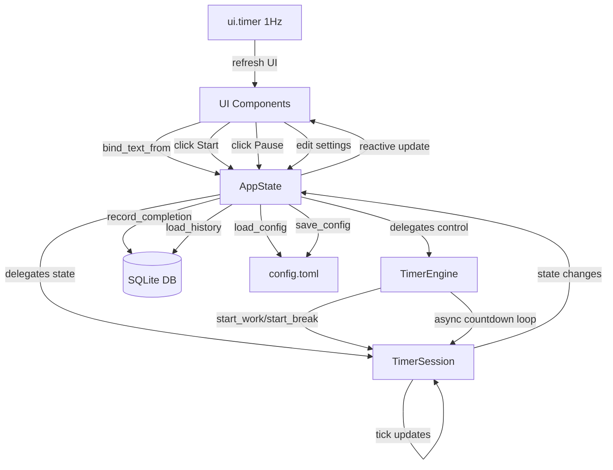
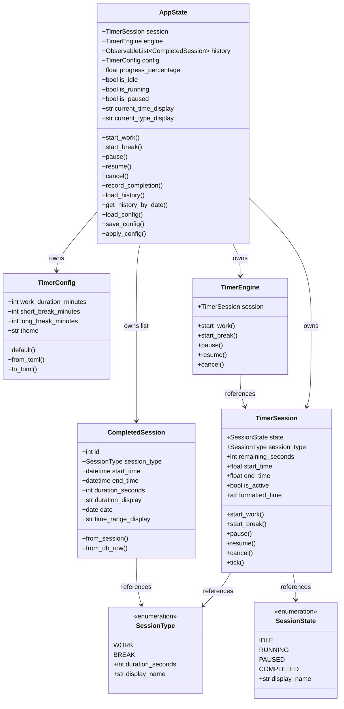

# Data Model: Python Library-Based UI

**Feature**: Python Library-Based UI (002-python-library-ui)  
**Date**: October 17, 2025  
**Status**: Design Phase

## Overview

This document defines the data models for the UI layer. The UI is a presentation layer that observes and controls the existing timer engine without duplicating business logic. Existing models (`TimerSession`, `SessionType`, `SessionState`) remain the source of truth.

## Existing Models (Reference Only)

These models already exist in `src/pomodoro_timer/models/` and are **NOT modified** by this feature:

### `TimerSession`

**Location**: `src/pomodoro_timer/models/session.py`

**Purpose**: Manages Pomodoro timer state and countdown logic.

**Fields**:
- `state: SessionState` - Current session state (IDLE, RUNNING, PAUSED, COMPLETED)
- `session_type: SessionType | None` - Type of session (WORK, BREAK) or None if idle
- `remaining_seconds: int` - Seconds remaining in current session
- `start_time: float | None` - Unix timestamp when session started
- `end_time: float | None` - Unix timestamp when session will end

**Key Properties**:
- `is_active: bool` - True if RUNNING or PAUSED
- `formatted_time: str` - Remaining time as "MM:SS"

**Key Methods**:
- `start_work() -> None` - Start 25-minute work session
- `start_break() -> None` - Start 5-minute break session
- `pause() -> None` - Pause running session
- `resume() -> None` - Resume paused session
- `cancel() -> None` - Cancel session and return to idle
- `tick() -> None` - Update remaining time (called periodically)

**State Transitions**:
```
IDLE ─────start_work()────> RUNNING
          start_break()        │
                               │
                            pause()
                               │
                               ▼
                            PAUSED
                               │
                           resume()
                               │
                               ▼
                            RUNNING ─────time reaches 0────> COMPLETED
                               │                                  │
                               │                              cancel()
                               └─────────cancel()─────────────────┘
                               │
                               ▼
                             IDLE
```

### `SessionType` (Enum)

**Location**: `src/pomodoro_timer/models/types.py`

**Purpose**: Defines session types and their default durations.

**Values**:
- `WORK` - Work session (25 minutes = 1500 seconds)
- `BREAK` - Break session (5 minutes = 300 seconds)

**Properties**:
- `duration_seconds: int` - Default duration for this session type
- `display_name: str` - Human-readable name ("Work" or "Break")

### `SessionState` (Enum)

**Location**: `src/pomodoro_timer/models/types.py`

**Purpose**: Defines possible timer states.

**Values**:
- `IDLE` - No session active
- `RUNNING` - Session in progress
- `PAUSED` - Session paused
- `COMPLETED` - Session finished

**Properties**:
- `display_name: str` - Human-readable name

## New Models (UI Layer)

### `AppState`

**Location**: `src/pomodoro_timer/ui/state.py`

**Purpose**: Bridge between UI components and timer engine. Exposes bindable properties for reactive UI updates.

**Fields**:
- `session: TimerSession` - Current timer session (reference to existing model)
- `engine: TimerEngine` - Timer engine instance (reference to existing engine)
- `history: ObservableList[CompletedSession]` - Observable list of completed sessions
- `config: TimerConfig` - Current configuration settings

**Computed Properties**:
- `progress_percentage: float` - Progress through current session (0-100)
- `is_idle: bool` - True if no session active
- `is_running: bool` - True if session running
- `is_paused: bool` - True if session paused
- `current_time_display: str` - Formatted time for display (delegates to `session.formatted_time`)
- `current_type_display: str` - Session type display name or "Idle"

**Control Methods** (async):
- `async start_work() -> None` - Start work session
- `async start_break() -> None` - Start break session
- `pause() -> None` - Pause current session
- `async resume() -> None` - Resume paused session
- `cancel() -> None` - Cancel current session

**History Methods**:
- `record_completion() -> None` - Save completed session to history and database
- `load_history() -> list[CompletedSession]` - Load session history from database
- `get_history_by_date(date: datetime.date) -> list[CompletedSession]` - Filter history by date

**Config Methods**:
- `load_config() -> TimerConfig` - Load configuration from TOML file
- `save_config(config: TimerConfig) -> None` - Save configuration to TOML file
- `apply_config(config: TimerConfig) -> None` - Apply config to SessionType durations

**Validation**:
- Duration values must be positive integers (>0)
- Duration values must be <= 999 minutes (prevent absurd values)
- Session type must be valid (WORK or BREAK)

**Relationships**:
- Has-one `TimerSession` (delegates state to existing model)
- Has-one `TimerEngine` (delegates control to existing engine)
- Has-many `CompletedSession` via `history` (owns UI-specific history state)
- Has-one `TimerConfig` (owns UI-specific configuration state)

### `CompletedSession`

**Location**: `src/pomodoro_timer/ui/models.py`

**Purpose**: Represents a completed Pomodoro session for history display.

**Fields**:
- `id: int | None` - Database ID (None if not yet persisted)
- `session_type: SessionType` - Type of completed session (WORK or BREAK)
- `start_time: datetime` - When session started (datetime object)
- `end_time: datetime` - When session ended (datetime object)
- `duration_seconds: int` - Actual duration of session

**Computed Properties**:
- `duration_display: str` - Formatted duration ("25 min" or "5 min")
- `date: datetime.date` - Date portion of start_time for grouping
- `time_range_display: str` - "HH:MM - HH:MM" format

**Factory Methods**:
- `@classmethod from_session(session: TimerSession) -> CompletedSession` - Create from active session
- `@classmethod from_db_row(row: sqlite3.Row) -> CompletedSession` - Create from database row

**Validation**:
- `end_time` must be after `start_time`
- `duration_seconds` must be positive
- `duration_seconds` should approximately equal `(end_time - start_time).total_seconds()`

**Relationships**:
- Stored in SQLite database (`sessions` table)
- References `SessionType` enum (WORK or BREAK)
- Displayed in UI via `ObservableList` in `AppState.history`

### `TimerConfig`

**Location**: `src/pomodoro_timer/ui/models.py`

**Purpose**: User-configurable timer settings.

**Fields**:
- `work_duration_minutes: int` - Duration for work sessions (default: 25)
- `short_break_minutes: int` - Duration for short breaks (default: 5)
- `long_break_minutes: int` - Duration for long breaks (default: 15)
- `theme: str` - UI theme ("auto", "light", "dark", default: "auto")

**Constants**:
```python
DEFAULT_CONFIG = TimerConfig(
    work_duration_minutes=25,
    short_break_minutes=5,
    long_break_minutes=15,
    theme="auto"
)

MIN_DURATION = 1  # Minimum 1 minute
MAX_DURATION = 999  # Maximum 999 minutes
```

**Validation Rules**:
- All duration fields must be in range `[MIN_DURATION, MAX_DURATION]`
- `theme` must be one of: "auto", "light", "dark"
- Fields must be integers (no floats)

**Factory Methods**:
- `@classmethod default() -> TimerConfig` - Create config with default values
- `@classmethod from_toml(path: Path) -> TimerConfig` - Load from TOML file
- `to_toml(path: Path) -> None` - Save to TOML file

**Relationships**:
- Persisted to `~/.config/pomodoro-timer/config.toml`
- Applied to `SessionType` enum values at startup
- Bound to settings form UI components

## Database Schema (SQLite)

### Table: `sessions`

**Purpose**: Persistent storage of completed Pomodoro sessions.

**Schema**:
```sql
CREATE TABLE sessions (
    id INTEGER PRIMARY KEY AUTOINCREMENT,
    session_type TEXT NOT NULL CHECK(session_type IN ('WORK', 'BREAK')),
    start_time REAL NOT NULL,      -- Unix timestamp (from datetime.timestamp())
    end_time REAL NOT NULL,        -- Unix timestamp (from datetime.timestamp())
    duration_seconds INTEGER NOT NULL CHECK(duration_seconds > 0),
    created_at REAL DEFAULT (strftime('%s', 'now'))
);

CREATE INDEX idx_session_type ON sessions(session_type);
CREATE INDEX idx_created_at ON sessions(created_at DESC);
CREATE INDEX idx_start_time ON sessions(start_time DESC);
```

**Columns**:
- `id`: Unique identifier (auto-increment)
- `session_type`: "WORK" or "BREAK" (constrained to valid values)
- `start_time`: When session started (Unix timestamp as float)
- `end_time`: When session ended (Unix timestamp as float)
- `duration_seconds`: How long session lasted (integer seconds, must be positive)
- `created_at`: Database insertion timestamp (for audit/recovery)

**Indexes**:
- Primary key on `id` (automatic)
- Index on `session_type` for filtering work vs. break sessions
- Index on `created_at` (descending) for recent sessions query
- Index on `start_time` (descending) for date-based grouping

**Queries**:

```sql
-- Get all sessions (most recent first)
SELECT * FROM sessions ORDER BY start_time DESC;

-- Get sessions for specific date
SELECT * FROM sessions 
WHERE date(start_time, 'unixepoch') = date(?)
ORDER BY start_time;

-- Get session count by type
SELECT session_type, COUNT(*) as count
FROM sessions
GROUP BY session_type;

-- Get total work time for date range
SELECT SUM(duration_seconds) as total_seconds
FROM sessions
WHERE session_type = 'WORK'
  AND start_time >= ?
  AND start_time <= ?;
```

**Database Location**:
- **Linux/macOS**: `~/.local/share/pomodoro-timer/sessions.db`
- **Windows**: `%USERPROFILE%\.local\share\pomodoro-timer\sessions.db`

(Follows XDG Base Directory specification for data files)

## Configuration File Format (TOML)

### File: `config.toml`

**Location**: `~/.config/pomodoro-timer/config.toml`

**Format**:
```toml
# Pomodoro Timer Configuration

[timer]
# Duration in minutes for work sessions
work_duration_minutes = 25

# Duration in minutes for short breaks
short_break_minutes = 5

# Duration in minutes for long breaks (not yet implemented)
long_break_minutes = 15

[ui]
# UI theme: "auto", "light", or "dark"
theme = "auto"
```

**Loading** (read-only, uses stdlib `tomllib`):
```python
import tomllib
from pathlib import Path

config_path = Path.home() / '.config' / 'pomodoro-timer' / 'config.toml'
with open(config_path, 'rb') as f:
    config_dict = tomllib.load(f)
    
config = TimerConfig(
    work_duration_minutes=config_dict['timer']['work_duration_minutes'],
    short_break_minutes=config_dict['timer']['short_break_minutes'],
    long_break_minutes=config_dict['timer']['long_break_minutes'],
    theme=config_dict['ui']['theme']
)
```

**Saving** (write, uses `tomli-w` library):
```python
import tomli_w
from pathlib import Path

config_path = Path.home() / '.config' / 'pomodoro-timer' / 'config.toml'
config_path.parent.mkdir(parents=True, exist_ok=True)

config_dict = {
    'timer': {
        'work_duration_minutes': config.work_duration_minutes,
        'short_break_minutes': config.short_break_minutes,
        'long_break_minutes': config.long_break_minutes,
    },
    'ui': {
        'theme': config.theme,
    }
}

with open(config_path, 'wb') as f:
    tomli_w.dump(config_dict, f)
```

## State Flow Diagram



## Data Validation Summary

### Input Validation

**Duration Settings**:
- **Range**: 1-999 minutes (inclusive)
- **Type**: Integer only (no floats)
- **Error Message**: "Duration must be between 1 and 999 minutes"

**Theme Setting**:
- **Values**: "auto", "light", "dark"
- **Type**: String (case-sensitive)
- **Error Message**: "Theme must be 'auto', 'light', or 'dark'"

**Session Type**:
- **Values**: "WORK", "BREAK"
- **Type**: String enum
- **Validated**: At database write (CHECK constraint)

### State Invariants

**TimerSession** (enforced by existing code):
- `remaining_seconds >= 0` (never negative)
- `end_time > start_time` (if both set)
- `session_type` is None iff `state == IDLE`
- State transitions follow valid paths (enforced by methods)

**CompletedSession**:
- `end_time > start_time` (enforced at creation)
- `duration_seconds > 0` (enforced by database CHECK constraint)
- `duration_seconds ≈ (end_time - start_time).total_seconds()` (within 1 second tolerance)

**AppState**:
- `session` is never None (always has TimerSession instance)
- `engine` is never None (always has TimerEngine instance)
- `config` is never None (loads default if file missing)
- `progress_percentage` is in range [0, 100]

## Relationship Diagram



## Migration Strategy

**No Migrations Required**: This is a new feature. Database and config files are created on first run if they don't exist. Schema is defined in code and applied via `CREATE TABLE IF NOT EXISTS`.

**Backward Compatibility**: Existing CLI functionality remains unchanged. UI is opt-in via new command-line flag or separate entry point.

## Testing Considerations

### Unit Tests

**`AppState` Tests** (`tests/unit/test_app_state.py`):
- Progress percentage calculation (0% idle, 50% halfway, 100% complete)
- State property getters (`is_idle`, `is_running`, `is_paused`)
- Control method delegation to engine
- Config validation (reject invalid durations, invalid themes)

**`CompletedSession` Tests** (`tests/unit/test_completed_session.py`):
- Factory methods (`from_session`, `from_db_row`)
- Computed properties (`duration_display`, `date`, `time_range_display`)
- Validation (end_time > start_time, positive duration)

**`TimerConfig` Tests** (`tests/unit/test_timer_config.py`):
- Default values correct
- TOML round-trip (save and load preserves values)
- Validation (reject out-of-range durations, invalid themes)

### Integration Tests

**Database Tests** (`tests/integration/test_session_history.py`):
- Insert completed session
- Query all sessions
- Query by date
- Query by session type
- Indexes improve query performance

**Config Tests** (`tests/integration/test_config_persistence.py`):
- Save config to file
- Load config from file
- Handle missing file (create with defaults)
- Handle corrupted file (log error, use defaults)

### Acceptance Tests (UI)

**Using `user` fixture** (`tests/integration/test_ui_acceptance.py`):
- See all user stories in `spec.md` Section "User Scenarios & Testing"
- Tests verify acceptance criteria directly using NiceGUI `user` fixture
- Example: "Given UI is launched, When user views main screen, Then they see timer state"

## Open Questions / Decisions Needed

1. **Long Break Implementation**: Spec mentions `long_break_minutes` config, but current `SessionType` only has WORK and BREAK. Should we add LONG_BREAK type in this feature or defer?
   - **Recommendation**: Defer to future feature. Config includes placeholder for future use, but not implemented in this feature (out of scope per spec Section "Out of Scope").

2. **Session Chaining**: Should the app automatically start breaks after work sessions complete?
   - **Recommendation**: Defer to future feature. Spec says "automatic session transitions" not mentioned in requirements. User manually starts each session (matches existing CLI behavior).

3. **Statistics/Analytics**: Should we add session counts, total time, etc. to history view?
   - **Recommendation**: Out of scope. Spec Section "Out of Scope" explicitly excludes "Analytics or detailed productivity reporting (beyond basic session history)".

4. **Multiple Break Types**: How to distinguish short break vs. long break in UI?
   - **Recommendation**: Current feature only implements one BREAK type (5 min). Long break support deferred to future feature.
